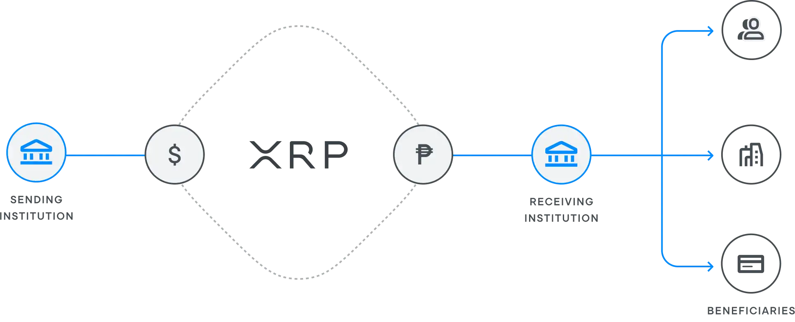

# Ripple Labs Analysis
----
![ripple][def2]
---
## Overview and Origin

* Name of the Company: Ripple Labs

* Incorporation Year: 2012

* Founders: Chris Larsen & Jed McCaleb
---

* Idea Origin: The idea for Ripple Labs came about with the aim of revolutionizing cross-border payments through the use of blockchain technology and the creation of a cryptocurrency known as XRP.

* Fund: Ripple Labs has received significant funding over the years. As of my last knowledge update in January 2022, specific funding details may have changed. Please check the latest financial reports for the most up-to-date information.
---
## Business Activities

* **Financial Problem**: Ripple Labs is focused on solving inefficiencies in cross-border payments. The traditional international money transfer system [*Swift*](https://www.swift.com/) is often slow and expensive, and Ripple aims to provide a faster and more cost-effective solution.

# 

* **Intended Customer**: Ripple's primary customers are financial institutions, including banks and payment service providers. The aim is to improve the efficiency of their cross-border transactions.

* **Market Size**: The market size for cross-border payments is substantial, with trillions of dollars transferred globally each year. "RippleNet’s Global Payments Solution Hits $30B Milestone"
Ripple, the renowned blockchain technology company, has recently revealed that it has processed an astounding amount of nearly $30 billion in up to 20 million transactions utilizing its proprietary global payments solution, RippleNet, since its inception.

Read more on DailyCoin: https://dailycoin.com/ripple-net-treasury-payments-guide/

* **Unique Solution**: Ripple offers a unique solution by leveraging the XRP cryptocurrency and the XRP Ledger to facilitate near-instant and low-cost cross-border transactions. This provides a competitive advantage over traditional methods and even some other blockchain-based solutions.

* **Technologies in Use**: Ripple Labs utilizes blockchain technology, with a focus on the XRP Ledger. The XRP Ledger is a decentralized blockchain that enables fast and secure transactions. Additionally, RippleNet, the network connecting financial institutions, employs various technologies to facilitate seamless transactions.

## Landscape

* **Domain in the Financial Industry**: Ripple operates in the domain of blockchain-based financial solutions, specifically targeting cross-border payments and remittances.

* **Major Trends and Innovations**: Over the last 10 years, the financial industry has seen a significant trend towards the adoption of blockchain technology. Innovations include faster transaction settlement, increased security, and the exploration of digital currencies.

* **Major Companies in the Domain**: Other major players in the blockchain-based financial services domain include [Ethereum](https://ethereum.org/en/) , [Stellar](https://stellar.org/), [Cardano](https://cardano.org/) and traditional financial institutions exploring blockchain solutions.

## Results

* **Business Impact**: Ripple Labs has made a substantial impact by providing a faster and more cost-effective alternative for cross-border payments. Its solutions have garnered attention and partnerships within the financial industry. Ripple Lab has also made a lot of noise in the newly regulated US Cryto space with the *SEC v. Ripple Case*. The results of this case has significant implications for both parties and the broader cyptocurrency industry.

* **Core Metrics**: Key metrics for success in this domain include transaction speed, cost per transaction, and the number of active partnerships. Ripple Labs has shown positive results in improving these metrics.

* **Performance Relative to Competitors**: Ripple has been a significant player in the blockchain-based financial services domain, with its focus on cross-border payments setting it apart from some competitors. Ripple’s transaction velocity is influenced by factors such as the consensus algorithm used, network infrastructure, scalability, and the use of XRP as a bridge currency, providing an advantage over competitors like Bitcoin, Ethereum, Stellar Lumens, and ADA in terms of transaction speed.

## Recommendations

* **Product/Service Recommendation**: Introduce a user-friendly consumer-facing application for cross-border payments, leveraging the efficiency of Ripple's technology. This could tap into the growing market of individuals seeking convenient and cost-effective international money transfers.

* **Benefits**: This product would benefit the company by expanding its reach beyond B2B transactions to a broader consumer market. It could also enhance brand visibility and loyalty.

* **Technologies Utilized**: The additional consumer-facing product would utilize user-friendly interfaces, mobile app development, and potentially incorporate emerging technologies such as decentralized finance (DeFi) for added financial services.

* **Appropriateness of Technologies**: These technologies are appropriate as they align with the growing trend of consumer-focused fintech solutions, providing accessibility and ease of use for a broader audience.

[def2]: Ripple.png

## Links
---
1. *RippleLab*](https://ripple.com/)
2. *SecVsRipplePressRelease*](https://www.sec.gov/news/press-release/2020-338)
3. *Swift*](https://www.swift.com/)
---